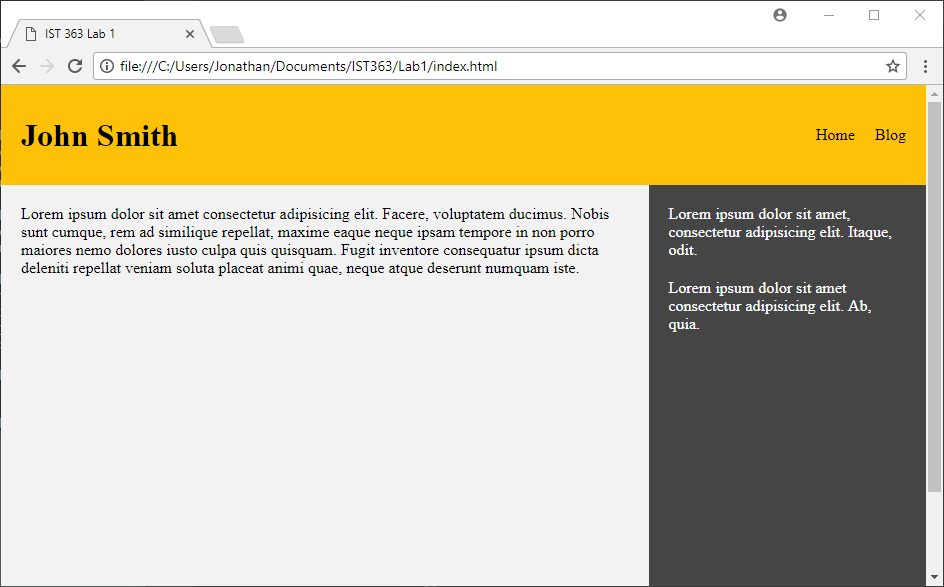
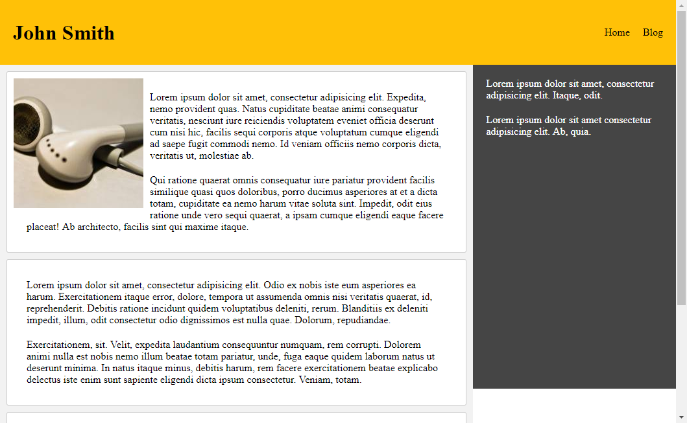

# Lab1 - Getting Started!

Creating a simple static website. Below is an image of what you will be creating. This will help get used to created web pages again.

### Homepage

### Blog Page

### Rubric

Git and Github
- (2pts) Accept the assignment from Github Classroom and **clone** it to your computer
- (6pts) Make at least 3 commits to GitHub (1 for each page created)

index.html
- (3pts) Created a header with the proper markup and styled correctly	3
- (3pts) Created a main content area and sidebar that are properly styled and positioned	3

blog.html
- (4pts) Created three blog posts and are styled correctly
- (1pt) Image in one of the blog posts is positioned and spaced correctly	1

Links
- (1pt) Navigation links work between the two pages (successful multi-page website)